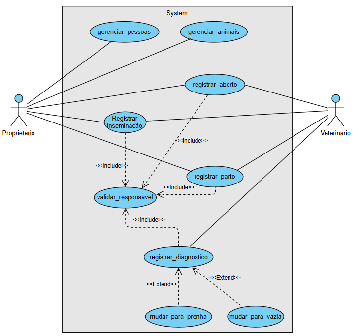

# Documentação do Projeto - Sistema de Gestão Reprodutiva Bovino

## 1. Descrição e Delimitação do Escopo
O sistema consiste em um software de gestão e controle reprodutivo para rebanhos bovinos. Destinado a proprietários rurais e médicos veterinários, o sistema resolve o problema da perda de histórico e da falta de rastreabilidade no ciclo de matrizes. Suas principais funcionalidades contemplam o cadastro de animais (machos e fêmeas), o controle automatizado de estados reprodutivos (Vazia, Inseminada e Prenha) e o registro histórico de eventos no manejo, como inseminações, diagnósticos de gestação (toque), partos e abortos.

## 2. Fase de Análise

### a) Requisitos Funcionais (RF)

| Identificador | Descrição | Prioridade | Depende de |
| :--- | :--- | :--- | :--- |
| **RF01** | O sistema deverá permitir o gerenciamento (inclusão, visualização, atualização e exclusão) de proprietários. | Alta | - |
| **RF02** | O sistema deverá permitir o gerenciamento de médicos veterinários. | Alta | - |
| **RF03** | O sistema deverá permitir o gerenciamento (inclusão, visualização, atualização e exclusão) de animais machos e fêmeas. | Alta | - |
| **RF04** | O sistema deverá permitir ao usuário registrar o evento de inseminação para uma fêmea. | Alta | RF02, RF03 |
| **RF05** | O sistema deverá transitar automaticamente o estado da fêmea para "Inseminada" ao registrar inseminação. | Alta | RF04 |
| **RF06** | O sistema deverá permitir ao usuário com perfil de Médico Veterinário registrar o evento de diagnóstico de gestação (toque). | Alta | RF02, RF03, RF05 |
| **RF07** | O sistema deverá transitar o estado da fêmea para "Prenha" caso o diagnóstico seja positivo. | Alta | RF06 |
| **RF08** | O sistema deverá permitir ao usuário registrar o evento de parto, gerando o histórico na matriz. | Alta | RF02, RF03, RF07 |
| **RF09** | O sistema deverá transitar o estado da fêmea de "Prenha" para "Vazia" após o registro de um parto. | Alta | RF08 |
| **RF10** | O sistema deverá permitir a listagem de todo o histórico de eventos reprodutivos de uma fêmea específica. | Alta | RF03 |
| **RF11** | O sistema deverá transitar o estado da fêmea para "Vazia" caso o diagnóstico seja negativo, registrando a falha da inseminação. | Alta | RF06 |
| **RF12** | O sistema deverá permitir registrar o evento de aborto para uma fêmea prenha, gerando o histórico na matriz. | Alta | RF02, RF03, RF07 |
| **RF13** | O sistema deverá transitar o estado da fêmea de "Prenha" para "Vazia" após o registro de um aborto. | Alta | RF12 |

### b) Regras de Negócio (RN)

| Identificador | Descrição | Prioridade | Depende de |
| :--- | :--- | :--- | :--- |
| **RN01** | Uma fêmea que se encontra no estado "Vazia" ou "Inseminada" não poderá receber o registro de um evento de "Parto" ou "Aborto". | Alta | RF08, RF09, RF12 |
| **RN02** | Todo evento reprodutivo registrado (Inseminação, Diagnóstico, Parto, Aborto) deverá possuir obrigatoriamente um Médico Veterinário ou Proprietário responsável atrelado. | Alta | RF04, RF06, RF08, RF12 |
| **RN03** | Apenas usuários cadastrados e logados como Médicos Veterinários (CRMV válido) terão permissão para acessar e registrar o Diagnóstico de Gestação (Toque). | Alta | RF06 |

### c) Requisitos Não Funcionais (RNF)

| Identificador | Descrição | Categoria | Escopo | Prioridade | Depende de |
| :--- | :--- | :--- | :--- | :--- | :--- |
| **RNF01** | O sistema deverá ser desenvolvido na linguagem Python usando Orientação a Objetos. | Implementação | Sistema | Alta | - |
| **RNF02** | O sistema deverá possuir uma interface gráfica desenvolvida com a biblioteca Tkinter. | Interface | Sistema | Alta | - |
| **RNF03** | O sistema deverá armazenar os dados em um banco de dados relacional PostgreSQL. | Restrições de Software | Sistema | Alta | - |
| **RNF04** | O sistema deverá implementar obrigatoriamente os padrões de projeto DAO e State. | Implementação | Sistema | Alta | - |
| **RNF05** | O sistema deverá validar o CPF de proprietários e veterinários. | Restrições de Integridade | Funcionalidade | Alta | RF01, RF02 |

## Diagrama de Casos de Uso

Abaixo apresentamos o Diagrama de Casos de Uso do sistema. Este modelo visual delimita a fronteira da aplicação e mapeia as interações entre os usuários externos e as funcionalidades internas. 

O diagrama reflete nossas regras de negócio e controle de acesso, evidenciando a separação de papéis entre o **Proprietário** (focado na gestão e registros cotidianos) e o **Veterinário** (com exclusividade técnica sobre laudos clínicos). Além disso, destaca a reutilização de rotinas através de relacionamentos de `<<include>>` para a validação de responsáveis, e fluxos condicionais de `<<extend>>` para transições de estados reprodutivos.

