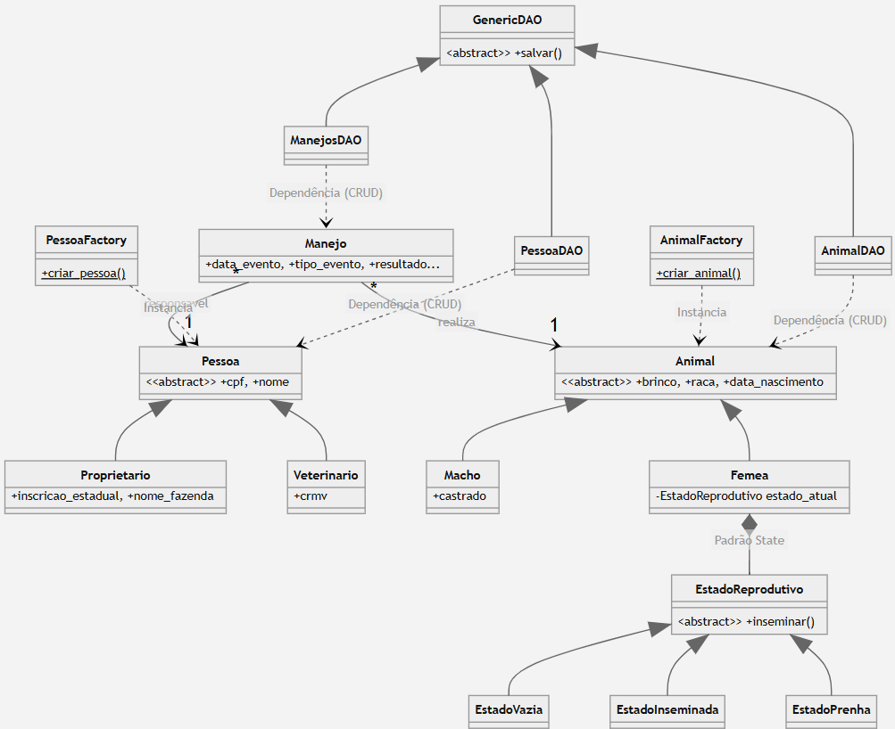

# Sistema de Gestão Reprodutiva Bovino

**Disciplina:** Análise e Projeto de Sistemas (APS) e Linguagem de Programação Orientada a Objetos (LPOO)  
**Aluno:** Daniel Cipriano da Silva  
**Período:** 2026/1  

## O Projeto
O sistema consiste em um software de gestão e controle reprodutivo para rebanhos bovinos. Ele resolve o problema da falta de rastreabilidade no ciclo reprodutivo de matrizes, permitindo o registro e a consulta de histórico de manejos (inseminações, toques, partos e abortos). O sistema transita automaticamente os estados reprodutivos das fêmeas (Vazia, Inseminada, Prenha) utilizando padrões de projeto e regras de negócio rígidas.

🔗 **[CLIQUE AQUI PARA ACESSAR A DOCUMENTAÇÃO COMPLETA DO PROJETO (Requisitos, Casos de Uso e Estados)](APS/Documentação_do_Projeto.md)**

## Diagrama de Classes do Sistema
O diagrama de classes a seguir detalha a arquitetura técnica do sistema no nível de projeto, especificando atributos, métodos relevantes, tipos de dados e a visibilidade dos três Padrões de Projeto aplicados na estrutura do software (DAO, Factory e State).

## Estrutura do Banco de Dados
O sistema utiliza o banco de dados relacional **PostgreSQL**, com a comunicação sendo realizada via driver `psycopg2` através do padrão de projeto DAO. O script de criação das tabelas (`banco.sql`) encontra-se na pasta `database` e foi modelado com restrições (`CHECK` e `FOREIGN KEY`) para garantir a integridade dos dados no nível do banco. 

O banco é composto por três tabelas principais:

* **`tb_pessoas`**: Tabela projetada para armazenar todos os responsáveis técnicos. Utiliza a coluna `tipo_pessoa` para diferenciar os cadastros entre *Proprietário* e *Veterinário*, garantindo por exemplo que a coluna `crmv` seja única para os profissionais da área.
* **`tb_animais`**: Armazena os dados do rebanho. A coluna `tipo_animal` diferencia *Macho* e *Fêmea*, permitindo que características reprodutivas distintas (como `is_castrado` para machos e `estado_reprodutivo` restrito a 'Vazia', 'Inseminada' ou 'Prenha' para fêmeas) coexistam na mesma tabela.
* **`tb_manejos`**: Funciona como a tabela transacional (histórico) do sistema. Ela liga as entidades principais relacionando o `brinco_animal` e o `cpf_responsavel` a cada evento reprodutivo. As exclusões seguem a regra `ON DELETE CASCADE` para os animais (se o animal for removido, seu histórico sai junto) e `ON DELETE RESTRICT` para pessoas (impedindo a exclusão de um veterinário que possua laudos assinados no sistema).

## Conclusão / Aprendizado
Durante o desenvolvimento deste projeto integrador, a principal dificuldade enfrentada foi sincronizar a interface gráfica construída em Tkinter com as regras de negócio complexas da modelagem Orientada a Objetos, garantindo que o banco de dados PostgreSQL refletisse exatamente as transições de estado das fêmeas. A solução encontrada foi a aplicação rigorosa do padrão MVC acoplado ao padrão DAO.

O maior aprendizado obtido foi a clareza de que uma boa documentação UML (Casos de Uso e Estados) facilita imensamente a programação. Modelar o comportamento do sistema antes de codificar tornou a implementação de regras impeditivas (como não permitir parto em fêmeas vazias) muito mais lógica e natural.

## Declaração de Uso de IA
Declaro que fiz o uso da Inteligência Artificial **Gemini (Google)** como ferramenta de apoio durante a elaboração deste trabalho. 
* **Etapas utilizadas:** O modelo funcionou como assistente pontual no desenvolvimento da interface gráfica (View), auxiliando no ajuste de detalhes visuais e na implementação dos filtros de busca em tempo real. O uso da ferramenta foi focado em impulsionar o aprendizado prático das tecnologias, servindo de apoio para compreender a lógica aplicada e resolver problemas de código.
* **Aprendizado:** O uso da IA contribuiu ativamente para o aprendizado de arquiteturas de código mais limpas.